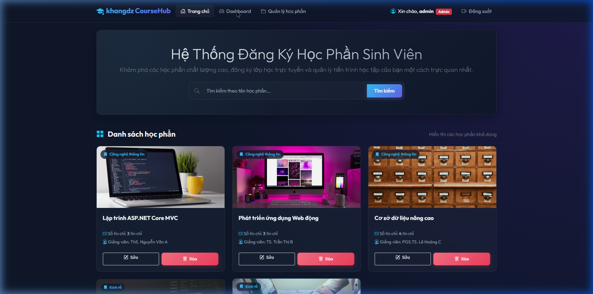
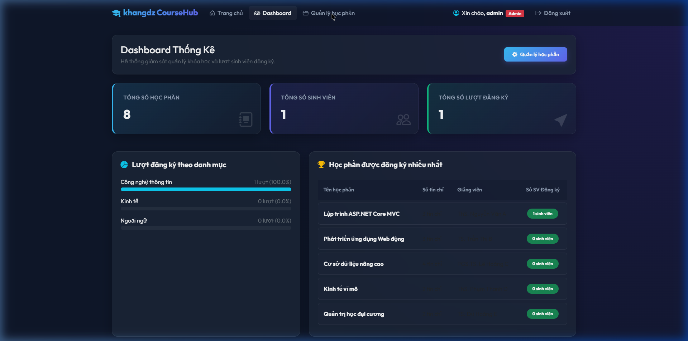

# Shop Khang - Cửa Hàng Thiết Bị Công Nghệ (ASP.NET Core 8.0 MVC)

Chào mừng bạn đến với dự án **Shop Khang** (Bài tập thực hành Tuần 5). Đây là một ứng dụng web thương mại điện tử hoàn chỉnh được phát triển trên nền tảng **ASP.NET Core 8.0 MVC** với giao diện **Glassmorphism Dark Premium** hiện đại, mượt mà và tối ưu trải nghiệm người dùng.

---

## 📸 Hình Ảnh Demo Giao Diện

### 1. Trang Chủ (Danh Sách Sản Phẩm & Mua Sắm)
Giao diện hiển thị danh sách sản phẩm trực quan, hỗ trợ tìm kiếm, phân trang, thêm vào giỏ hàng và xem chi tiết.


### 2. Trang Quản Trị Admin (Dashboard & Quản Lý Đơn Hàng)
Trang quản trị dành riêng cho Admin để quản lý danh mục, sản phẩm và theo dõi danh sách các đơn đặt hàng từ khách hàng.


---

## ✨ Các Tính Năng Nổi Bật

### 🛒 Dành cho Khách Hàng (Customer)
- **Xem sản phẩm & Tìm kiếm**: Tìm kiếm sản phẩm thông minh theo tên, lọc sản phẩm theo phân trang.
- **Giỏ hàng (Shopping Cart)**: Thêm/xóa sản phẩm, tự động tính tổng tiền thực tế.
- **Thanh toán (Checkout)**: Nhập thông tin giao hàng, ghi chú đơn hàng và xác nhận đặt hàng nhanh chóng.
- **Xem lịch sử / Xác nhận đơn**: Nhận thông tin mã đơn hàng sau khi hoàn tất thanh toán.

### 🛡️ Dành cho Quản Trị Viên (Admin)
- **Quản lý sản phẩm**: Thêm, sửa, xóa sản phẩm kèm hình ảnh trực quan.
- **Quản lý danh mục**: Tạo mới, sửa đổi hoặc xóa danh mục sản phẩm.
- **Quản lý đơn hàng**: Xem danh sách các đơn hàng đã đặt, thông tin địa chỉ khách hàng và doanh thu.

---

## 🛠️ Công Nghệ & Giải Pháp Kỹ Thuật

- **Backend**: ASP.NET Core 8.0 MVC, Entity Framework Core.
- **Database**: SQL Server (LocalDB / Express).
- **Authentication**: ASP.NET Core Identity (Quản lý User & Phân vai Admin, Customer, Employee, Company).
- **Session State**: Quản lý giỏ hàng thông qua Session Memory Cache.
- **Font & Encoding**: Tối ưu hóa UTF-8 (Without BOM) loại bỏ hoàn toàn lỗi hiển thị tiếng Việt (Mojibake) và sửa các lỗi biên dịch Razor (`RZ2005`, `CS1963`).

---

## 🚀 Hướng Dẫn Cài Đặt & Chạy Dự Án

### 1. Yêu Cầu Hệ Thống
- [.NET SDK 8.0+](https://dotnet.microsoft.com/download/dotnet/8.0)
- SQL Server LocalDB hoặc SQL Server Express.

### 2. Các Bước Cài Đặt
1. **Clone repository này về máy:**
   ```bash
   git clone https://github.com/khang1233/BtLtWebBuoi5.git
   cd BtLtWebBuoi5
   ```

2. **Cấu hình chuỗi kết nối Database:**
   Mở tệp `appsettings.json` và điều chỉnh `DefaultConnection` phù hợp với máy của bạn:
   ```json
   "ConnectionStrings": {
     "DefaultConnection": "Server=(localdb)\\mssqllocaldb;Database=TranMinhKhang_Tuan5;Trusted_Connection=True;MultipleActiveResultSets=true"
   }
   ```

3. **Cập nhật Database (Migrations):**
   ```bash
   dotnet ef database update
   ```

4. **Khởi chạy ứng dụng:**
   ```bash
   dotnet run
   ```
   Ứng dụng sẽ chạy tại địa chỉ: `http://localhost:5138` (hoặc `http://localhost:7095` qua IIS Express).

---

## 🔑 Tài Khoản Thử Nghiệm

Hệ thống đã tự động gieo mầm (seed) các tài khoản thử nghiệm sau khi khởi chạy:

| Vai Trò | Email | Mật Khẩu |
| :--- | :--- | :--- |
| **Admin** | `admin@gmail.com` | `Admin@123` |
| **Customer** | `customer@gmail.com` | `Customer@123` |
| **Employee** | `employee@gmail.com` | `Employee@123` |
| **Company** | `company@gmail.com` | `Company@123` |

---

*Phát triển bởi Antigravity & khang1233.*
